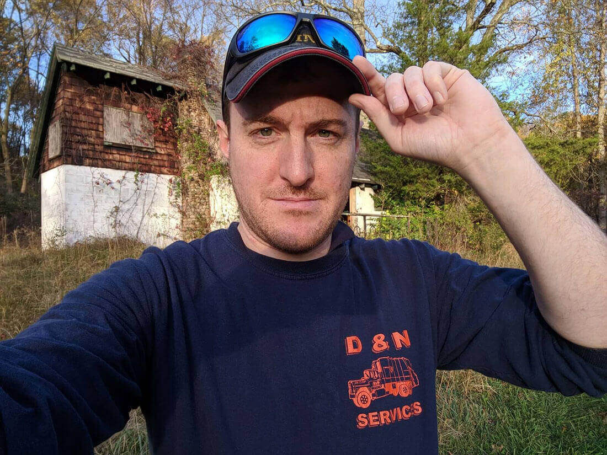

Greetings! I’m Orion Anderson, a developer living in New York City. I am currently a DevOps Developer at [Havas Production Studios](https://havasproductionstudios.com). I manage Jenkins and Windows servers and code in Python and PowerShell to help smooth the development process.

Since 2014 I have been volunteering as a web developer at [Emerald Isle Immigration Center](https://eiic.org), lending my skills to enhance their website.

Previously, I was System Administrator at [Library of Social Science](https://www.libraryofsocialscience.com). Our website attracts a world-wide audience—exploring the sources and meanings of collective forms of violence. Prior to this, I was an editor, developing email marketing campaigns and online publications.

