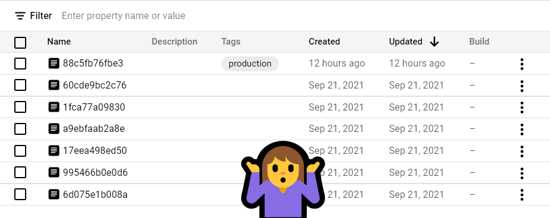

When we push a container image to Google Artifact Registry with the same tag as an existing image, the tag on the existing image is removed, leaving us an image with no tag.



All images take up space and count towards your bill. Assuming you have no use for the untagged images, wouldn't it be nice if we could remove all of them at once?

## Existing Solutions

Unlike Amazon's ECR Lifecycle Policies, there is **currently** no official way to do this on GCP, but we have options.

I've seen a few ways to tackle this issue, notably [GCR Cleaner](https://github.com/sethvargo/gcr-cleaner), which is mentioned in Google's Container Registry's [official documentation](https://cloud.google.com/container-registry/docs/managing#deleting_images). There are also some good methods in this [Stack Overflow question](https://stackoverflow.com/questions/46451173/delete-untagged-images-on-google-cloud-registry).

Give these approaches a read to see if they might fit your use case.

## My Solution

My solution uses Cloud Build and Cloud Scheduler with a dash of PowerShell and shell scripting. It is a bit simpler than the solutions referenced above, but works well.

> The commands below are for Google Cloud *Artifact Registry* (not to be confused with *Container Registry*). You can easily modify the `gcloud` commands below to accommodate the latter.

**Prerequisites**

* A service account for your Cloud Scheduler job with the Cloud Build Editor role so it can trigger the builds.
* Your Cloud Build service account should already have permission to list artifact registry images in your project, but you may need to give it the additional `artifactregistry.versions.delete` permission.
* A git repository containing the 2 files below, added as a Source to your Cloud Build trigger.

## Cloud Build Script

Set the `_REPO` substitution variable in your Cloud Build trigger to the image repository you want to clean up, for example: 

`us-central1-docker.pkg.dev/my-project/my-container-apps`

```yaml
# cloudbuild.yaml

steps:
  - id: List untagged images
    name: gcr.io/cloud-builders/gcloud
    entrypoint: sh
    args:
      - -c
      - |
        gcloud artifacts docker images list $_REPO --include-tags \
          --filter='-tags:*' --format=json > untagged.json
        cat untagged.json
  - id: Format list of untagged images
    name: mcr.microsoft.com/powershell
    entrypoint: pwsh
    args:
      - ./New-UntaggedImageList.ps1
  - id: Delete untagged images
    name: gcr.io/cloud-builders/gcloud
    entrypoint: sh
    args:
      - -c
      - |
        if test -f clean.txt; then
          while read i; do
            gcloud artifacts docker images delete --quiet "$i"
          done < clean.txt
        else
          echo "No untagged images."
        fi

```

If you are fluent in shell scripting you could probably omit the PowerShell step above and flesh out the shell script in the last step with some JSON parsing. Compared to my approach, this is cleaner because it doesn't require writing to the filesystem and the additional build step. But I find that PowerShell is nicer to use when working with the JSON omitted by `gcloud`.

## PowerShell Script

The PowerShell script takes our `untagged.json`, parses it, concatenates each package and digest (sha256) into a string on a single line, and appends it to a text file. If the JSON file is empty (*i.e.*, no untagged images), this step is skipped.

```powershell
# New-UntaggedImageList.ps1

$UntaggedImages = Get-Content untagged.json | ConvertFrom-Json

If ($UntaggedImages) {
    $UntaggedImages | ForEach-Object {
        $p, $v = $_.package, $_.version
        Add-Content clean.txt "$p`@$v"
    }
} Else {
      Write-Host 'No untagged images.'
}

```

## The End

I set my Cloud Scheduler job frequency to `33 15 * * 4` so it runs once a week on Thursday at 15:33 in my time zone. Instead of using Cloud Scheduler to trigger your build, you could certainly integrate the steps into an existing build.