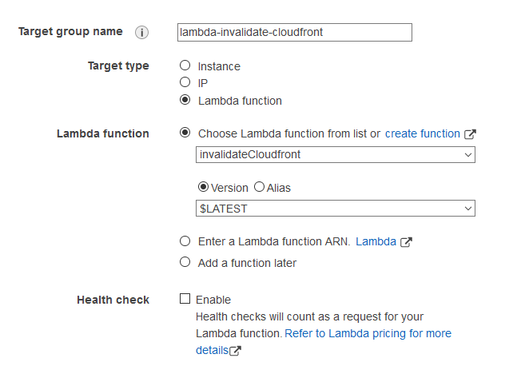
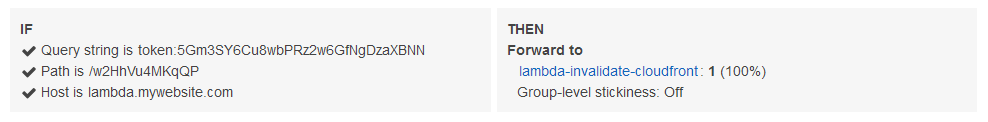

The other day I was moving a friend's static website over to Netlify. It's a simple static [Hugo](https://gohugo.io) site with only a handful of pages and images. What makes the site unique is the hundreds of large PDF files.

Initially, I looked into storing the PDF files in [Git LFS](https://git-lfs.github.com/). It's a cool technology and both Netlify and GitHub support it. Unfortunately, I quickly hit the storage limit of my GitHub account. I didn't feel like paying to increase it, just for this one site.

So, I rolled up a tidy Netlify/AWS hybrid solution. Netlify builds the static HTML files, while the PDFs reside in S3. CloudFront sits at the fore, using Netlify as the default origin, and an S3 origin for the content under `/pdf`.

This solved the large file problem. Cheap, durable storage of the PDFs in S3, with Netlify's dead-simple CI/CD automation.

Yet, there is another problem. What if we update the site content files and Netlify does a deploy? How will CloudFront know there is new content? We need to somehow send an invalidation request to CloudFront after each Netlify deploy.

I decided to create my own webhook using AWS.

## AWS webhook recipe

Simply put, the webhook is a listener on my Application Load Balancer (ALB) that points to a Lambda function. For convenience, I have a `lambda.` subdomain pointed at the ALB. The ALB listens for that host, and specific query strings, then forwards it to the Lambda. The Lambda runs some Python code to generate a CloudFront invalidation.

### IAM role for Lambda

Before creating the Lambda function, I created an IAM role with very basic permissions. The role only needs permission to create a CloudFront invalidation request.

```json
{
    "Version": "2012-10-17",
    "Statement": [
        {
            "Sid": "VisualEditor0",
            "Effect": "Allow",
            "Action": "cloudfront:CreateInvalidation",
            "Resource": "*"
        }
    ]
}
```

### Lambda function

Next, I created the Lambda function using Python. The function creates an invalidation request and returns a 200 HTTP status code to Netlify.

```python
# lambda_function.py

import boto3
import json
import time


def lambda_handler(event, context):
    client = boto3.client("cloudfront")

    distribution = event["queryStringParameters"]["dist"]
    request = client.create_invalidation(
        DistributionId=distribution,
        InvalidationBatch={
            "Paths": {"Quantity": 1, "Items": ["/*"]},
            "CallerReference": str(time.time()),
        },
    )
    response = {
        "statusCode": 200,
        "statusDescription": "200 OK",
        "isBase64Encoded": False,
        "headers": {"Content-Type": "text/html"},
        "body": "<h1>Invalidation in progress.</h1>",
    }
    return response

```

I wanted a function I could use with other distributions, so we tell Lambda to look for a query string parameter `dist` corresponding to a CloudFront distribution ID.

We invalidate all paths in the site with `/*`. This is fine for small sites. If your needs are more complex, you can use a Python list with multiple paths. CloudFront also needs a unique `CallerReference` so we just use the current time.

Finally, we send a JSON response back to the ALB with a 200 HTTP response code. Netlify requires webhooks to return a HTTP response code (other than 4xx or 5xx), otherwise the webhook is disabled.

I used the IAM role defined earlier for this function.

### Application Load Balancer setup

In my ALB settings, I created a target group and pointed it at my Lambda.



Then, I created a listener. It watches for a path, and a querystring with a key of `token` assigned a random value. The value is random to provide a little security.

Here's an example of how the listener might look:



## Conclusion

Now I can put together a tidy URL:

```text
https://lambda.mysite.com/webhooks?dist=EWR32F5MCGOV3&token=u9LP6qbQ
```

...and plop it into my Netlify deploy configuration.

When the deploy succeds, Netlify sends a POST request to the URL. The load balancer triggers the Lambda function and CloudFront begins its invaldiation.
