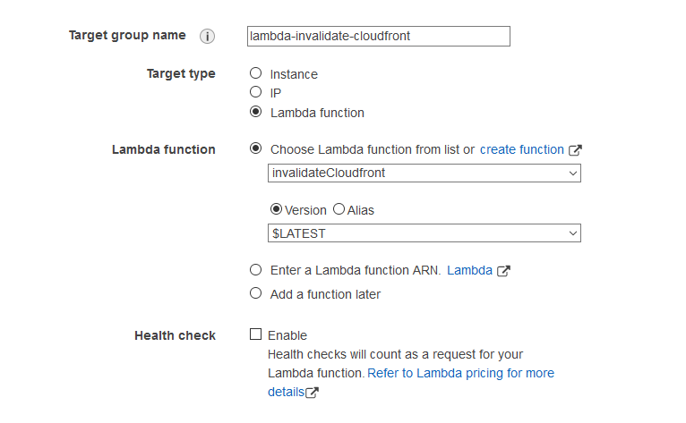
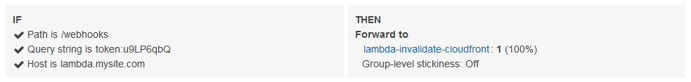

The other day I was moving a friend's static website over to Netlify. His site is a simple static site with only a handful of pages and images. What makes his page unique is the hundreds of large PDF files that he hosts.

Initially, I looked into storing the large PDF files in [Git LFS](https://git-lfs.github.com/). Both Netlify and GitHub support it. Unfortunately, I quickly hit the storage limit of my GitHub account and I didn't feel like paying to increase it, just for this one site.

I rolled up a tidy Netlify/AWS hybrid solution. Netlify builds his site with Hugo, while the PDFs reside safely in S3. CloudFront sits in front using Netlify as the default origin, and an S3 origin for the content under `/pdf`.

This solves the problem of storage. I keep the simple CI/CD automation of Netlify but also the benefits of S3 for the PDF files. Dead simple automation and cheap, durable storage of the big files.

Yet, there is another problem. What if we update the site content files and Netlify does a deploy? How will CloudFront know there is new content? We need to somehow send an invalidation request to CloudFront after each Netlify deploy.

I decided to create my own webhook.

## AWS Webhook Recipe

The webhook is simply a listener on my Application Load Balancer (ALB) that points to a Lambda function. I have a subdomain set up in Route53 and point it at the ALB. The ALB listens for that host, and specific query strings, then forwards it to the Lambda. The Lambda runs some Python code to create a CloudFront invalidation

### IAM role

Before creating the Lambda function, I created an IAM role with very basic permissions. The role needs permission to create a CloudFront invalidation request, and that is all.

```json
{
    "Version": "2012-10-17",
    "Statement": [
        {
            "Sid": "VisualEditor0",
            "Effect": "Allow",
            "Action": "cloudfront:CreateInvalidation",
            "Resource": "*"
        }
    ]
}
```

### Lambda function

Next I created a simple Lambda function. The function should simply create an invalidation request and provide a 200 status code to Netlify, signaling that the webhook succeeded.

I wanted a function I could reuse, such as with other distributions, so we tell the Lambda to look for a query string parameter `dist`. This parameter  corresponds to a distribution ID.

Then, we invalidate all paths in the site with `/*`. This is fine for small sites. However, your needs might require something more complex, such as a dictionary with multiple paths. CloudFront also needs a unique `CallerReference` so we just use the current time.

Finally, we send a JSON response back to the ALB with an HTTP response code. Netlify requires webhooks to return a HTTP response code (other than 4xx or 5xx), otherwise the webhook is disabled.

```python
# lambda_function.py

import boto3
import json
import time


def lambda_handler(event, context):
    client = boto3.client("cloudfront")

    distribution = event["queryStringParameters"]["dist"]
    request = client.create_invalidation(
        DistributionId=distribution,
        InvalidationBatch={
            "Paths": {"Quantity": 1, "Items": ["/*"]},
            "CallerReference": str(time.time()),
        },
    )
    response = {
        "statusCode": 200,
        "statusDescription": "200 OK",
        "isBase64Encoded": False,
        "headers": {"Content-Type": "text/html"},
        "body": "<h1>Invalidation in progress.</h1>",
    }
    return response

```

### ALB Setup

Inside my ALB, I created a target group that points at my Lambda.



Then I created a listener that watches for a path, and a querystring with a key of `token` and a random value. The value is random to give myself a little more security.

Here's an example of how the listener might look:



## Conclusion

Now I can put together a URL that looks like this:

```text
https://lambda.mysite.com/webhooks?dist_id=EWR32F5MCGOV3&token=u9LP6qbQ
```

And plop it into my Netlify deploy configuration.

This solved the problem of getting Netlify and CloudFront to communicate! When the deploy succeds, Netlify sends a POST request to the URL. The load balancer triggers the Lambda function and CloudFront begins its invaldiation.
