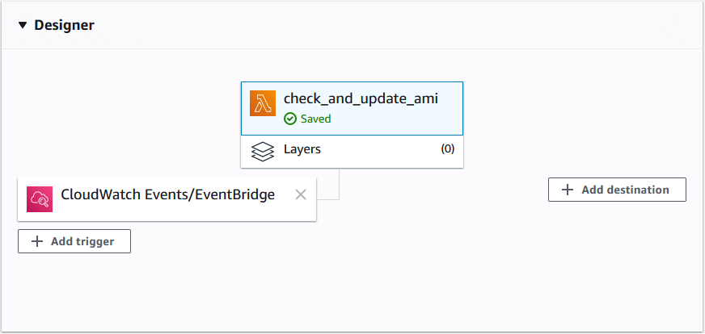
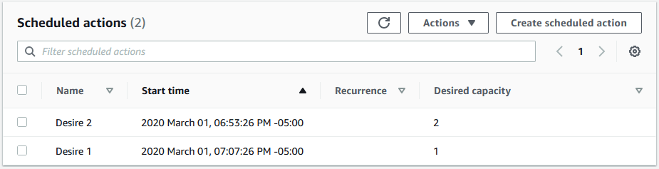

Tired of manually updating your EC2 launch templates and auto-scaling groups?

I run all of my applications in containers on Amazon's Elastic Container Service (ECS). If you're familiar with ECS, you know that AWS frequently updates its ECS-Optimized AMI for EC2. The update contains all kinds of goodies, such as new versions of the ECS Agent, kernel updates, security patches, and other miscellaneous fixes.

How do we update all instances in our ECS cluster with the new AMI? Since we want to *automate all the things*, let's do it with Python and AWS Lambda!

## Scheduling

First, let's consider how our Lambda can be triggered. One way is with SNS notifications. Thankfully, AWS publishes new AMI information as SNS topics. Check the [official docs](https://docs.aws.amazon.com/AmazonECS/latest/developerguide/ECS-AMI-SubscribeTopic.html) to find the Amazon SNS Topic ARN for your region. I use `us-east-2` in this guide.

> We subscribe to the topic for our region and add our Lambda function as an endpoint, which will allow us to add it as a trigger in the designer.



## IAM policy for Lambda

Before writing any code I like to sketch out an IAM policy. If I don't perform this step at the beginning, I'll inevitably find that my tests don't work and I'll start second-guessing my code. Approaching the problem with a security-first mindset also helps me think about how the building blocks fit together.

Below is the final IAM policy for this Lambda function's IAM role. We allow describing, creating and deleting launch template versions, creating auto-scaling group actions, and publishing SNS notifications.

> If you would like to use this policy, add the full `arn` of your EC2 launch template, SNS topic, and auto-scaling group.

```json
{
    "Version": "2012-10-17",
    "Statement": [
        {
            "Effect": "Allow",
            "Action": "ec2:DescribeLaunchTemplateVersions",
            "Resource": "*"
        },
        {
            "Effect": "Allow",
            "Action": [
                "sns:Publish",
                "ec2:ModifyLaunchTemplate",
                "ec2:DeleteLaunchTemplateVersions",
                "ec2:CreateLaunchTemplateVersion",
                "autoscaling:PutScheduledUpdateGroupAction"
            ],
            "Resource": [
                "arn:aws:sns: ... ",
                "arn:aws:ec2: ... ",
                "arn:aws:autoscaling: ... "
            ]
        }
    ]
}
```

## Lambda function

The Lambda itself is blunt-force Python. My favorite!

1. Retrieve the ECS-optimized AMI ID from the SNS message data.
2. Update the launch template with the AMI ID.
3. Set the new launch template version as the default version.
4. Delete the `$Latest -2` version of the launch template and keep `$Latest -1`.
5. Create ASG scheduled actions to replace instances.
6. Publish an SNS event notifying me that the AMI has been updated.

> In this example, imagine we have an ASG already configured with `MinCapacity=1`, `MaxCapacity=2` and `DesiredCapacity=1`. An army of `1`! You should adjust these values depending on the size of your auto-scaling group.

```python
# lambda_function.py
import boto3, os, json
from datetime import datetime, timezone, timedelta


def lambda_handler(event, context):

    # Get values from Lambda environment variables.
    launch_template_id = os.environ["launch_template_id"]
    sns_arn = os.environ["sns_arn"]
    asg_name = os.environ["asg_name"]

    # Create boto3 clients
    ec2 = boto3.client("ec2")
    asg = boto3.client("autoscaling")
    sns = boto3.client("sns")

    # Parse the SNS message and get the new image id
    sns_message = json.loads(event["Records"][0]["Sns"]["Message"])
    new_ami = sns_message["ECSAmis"][0]["Regions"]["us-east-2"]["ImageId"]

    def update_current_launch_template_ami(ami):
        response = ec2.create_launch_template_version(
            LaunchTemplateId=launch_template_id,
            SourceVersion="$Latest",
            VersionDescription="Latest-AMI",
            LaunchTemplateData={
                "ImageId": ami
            }
        )
        print(f"New launch template created with AMI {ami}")

    def set_launch_template_default_version():
        response = ec2.modify_launch_template(
            LaunchTemplateId=launch_template_id,
            DefaultVersion="$Latest"
        )
        print("Default launch template set to $Latest.")
        previous_version = str(
            int(response["LaunchTemplate"]["LatestVersionNumber"]) - 2)
        response = ec2.delete_launch_template_versions(
            LaunchTemplateId=launch_template_id,
            Versions=[
                previous_version,
            ]
        )
        print(f"Old launch template {previous_version} deleted.")

    def create_asg_scheduled_action(start_time, desired_capacity):
        response = asg.put_scheduled_update_group_action(
            AutoScalingGroupName=asg_name,
            ScheduledActionName=f"Desire {desired_capacity}",
            StartTime=start_time,
            DesiredCapacity=desired_capacity
        )
        print(f"""
            ASG action created
            Start time: {start_time}"
            Desired capacity: {desired_capacity}
            """)

    def send_sns_notification(subject, message):
        response = sns.publish(
            TargetArn=sns_arn,
            Message=message,
            Subject=subject,
        )
        print(f"""
            Notification email sent.
            Subject: {subject}
            Message: {message}
            """)

    def update_launch_template_and_asg():
        # Update template AMI and set as default
        update_current_launch_template_ami(new_ami)
        set_launch_template_default_version()

        # Create future ASG actions to roll out the new AMI
        now_utc = datetime.now(timezone.utc)
        in_01_min = now_utc + timedelta(minutes=1)
        in_15_min = now_utc + timedelta(minutes=15)
        create_asg_scheduled_action(in_01_min, 2)
        create_asg_scheduled_action(in_15_min, 1)

        # Send a notification that the update succeeded.
        subject = "AMI updated!"
        message = f"AMI updated! New AMI is {new_ami}."
        send_sns_notification(subject, message)
        return message

    ami_status = update_launch_template_and_asg()

    # Show if AMI was updated in CloudWatch log group.
    print(ami_status)

    # Show if AMI was updated in Lambda console.
    return ami_status

```

The trickiest bit of the code was getting the current launch template AMI out of the SNS message. Fortunately, it was just a matter of loading the JSON data and hunting down the key/value.

## ASG scheduled actions

If you look closely at the code above, you see that it sets the ASG `DesiredCapacity=2` then sets it back to `1` after 15 minutes. This is enough time for the new instances to spin up, applications to reach a healthy state and the load balancer to start sending traffic to them. Depending on your applications, you may need to play with this window to ensure zero downtime.



> Our ASG termination policy is configured to terminate instances with the oldest launch configuration first. This ensures that instances using the old launch template are automatically removed.

## Conclusion

We now have a nice, light Lambda that updates launch templates with the latest ECS-Optimized AMI immediately upon release, and updates all ECS instances in our cluster.

I'm enjoying using Lambdas to automate parts of my AWS infrastructure. In a lot of ways, it's easier to write automation code than rely on tools AWS may or may not have. Boto3 is powerful, and the documentation is great, unlike many AWS docs.

Hopefully, this mini-tutorial helps some automation fans out there!
