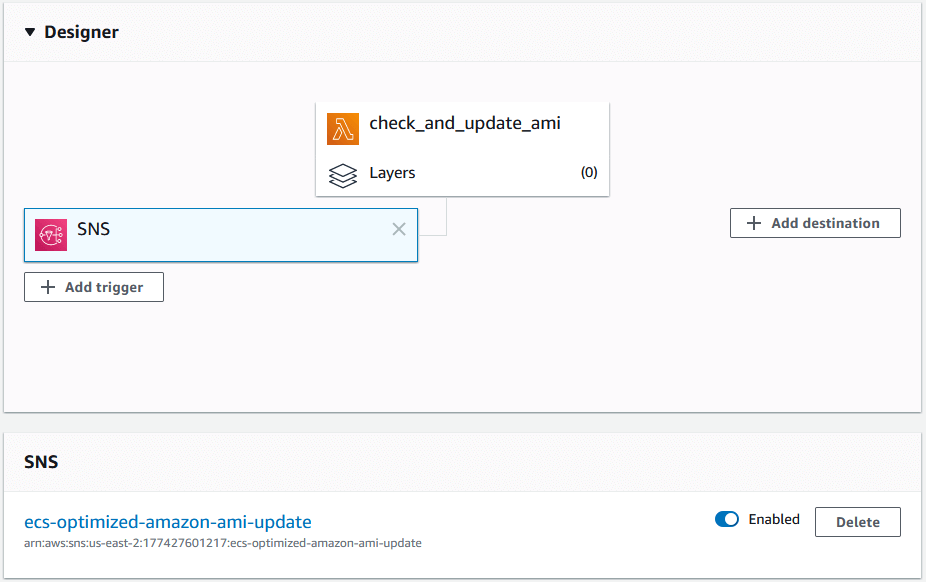

Are you sick and tired of updating your AWS auto-scaling groups manually? This post may be for you.

AWS frequently updates the Amazon Machine Image (AMI) for Elastic Container Service (ECS). The updates usually contain a newer version of the ECS agent as well as kernel updates, security updates, and other miscellaneous fixes. I love patches, but I don't like patching. Eventually, I got tired of clicking around in the console to update my Auto-Scaling Group (ASG) Launch Templates with the new AMI image ID.

I created a little Lambda function to take care up of the updates automatically.

## Overview

At 1 p.m. every day, the function checks a parameter which contains the latest-and-greatest ECS AMI ID. Then the function compares this AMI ID with the AMI ID in my ASG launch template. If the two values are different, the function updates the launch template with the new ID. It then sets the new version as the default version and deletes the `$Latest -1` version, so I can roll back if there are any breaking changes in the new AMI.

My ASG is configured to remove instances older than 2 weeks and replace them with fresh instances. Thus, over time, all instances in my ASG will gradually be updated with the latest AMI.

## IAM role for Lambda

As usual, my first step is to create an IAM role. If I don't do this at the beginning, I'll find that my script doesn't work and I'll start second-guessing my code. Looking at it from a permissions-first perspective also helps me think about how the pieces fit together.

Below is the IAM role for this Lambda function. We allow getting a parameter with the latest launch template version, creating and deleting launch template versions and sending SNS notification updates. The resource names are made up for security reasons.

```json
{
    "Version": "2012-10-17",
    "Statement": [
        {
            "Effect": "Allow",
            "Action": [
                "ec2:DescribeLaunchTemplateVersions",
                "ssm:GetParameter"
            ],
            "Resource": "*"
        },
        {
            "Effect": "Allow",
            "Action": [
                "sns:Publish",
                "ec2:DeleteLaunchTemplateVersions",
                "ec2:CreateLaunchTemplateVersion"
            ],
            "Resource": [
                "arn:aws:sns:us-east-2:xxx:FAKE-NOTIFY-TOPIC",
                "arn:aws:ec2:us-east-2:xxx:launch-template/lt-xxx"
            ]
        }
    ]
}
```

## Lambda function

The Lambda is pretty basic Python. The code grabs some environment variables from the Lambda settings. Then it queries the latest IAM ID and compares it to the IAM that the latest launch configuration uses. If the two are different, it updates the launch configuration to use the new IAM and publishes a notification to SNS, which I get in my email inbox.

```python
# lambda_function.py

import boto3
import os

# Get these values from the Lambda environment variables.
launch_template_id = os.environ['launch_template_id']
image_id_ssm_parameter = os.environ['image_id_ssm_parameter']
sns_arn = os.environ['sns_arn']


def lambda_handler(event, context):

    ssm_client = boto3.client('ssm')
    ec2_client = boto3.client('ec2')
    sns_client = boto3.client('sns')

    def get_latest_ecs_ami():
        response = ssm_client.get_parameter(
            Name=image_id_ssm_parameter,
        )
        latest_ecs_ami = response['Parameter']['Value']
        print(f"Latest ECS-Optimized AMI: {latest_ecs_ami}")
        return latest_ecs_ami

    def get_current_launch_template_ami():
        response = ec2_client.describe_launch_template_versions(
            LaunchTemplateId=launch_template_id,
            Versions=[
                '$Latest',
            ],
        )
        current_launch_template_ami = (
            response['LaunchTemplateVersions'][0]['LaunchTemplateData']['ImageId']
        )
        print(f"Current Launch Template AMI: {current_launch_template_ami}")
        return current_launch_template_ami

    def update_current_launch_template_ami(ami):
        response = ec2_client.create_launch_template_version(
            LaunchTemplateId=launch_template_id,
            SourceVersion='$Latest',
            VersionDescription='Latest-AMI',
            LaunchTemplateData={
                'ImageId': ami
            }
        )
        print(f"New launch template created with AMI: {ami}")

    def set_launch_template_default_version():
        response = ec2_client.modify_launch_template(
            LaunchTemplateId=launch_template_id,
            DefaultVersion='$Latest'
        )
        previous_version = str(
            int(response['LaunchTemplate']['LatestVersionNumber']) - 2)

        response = ec2_client.delete_launch_template_versions(
            LaunchTemplateId=launch_template_id,
            Versions=[
                previous_version,
            ]
        )
        print(f"Launch template {previous_version} deleted.")

    def send_sns_nofication(subject, message):
        response = sns_client.publish(
            TargetArn=sns_arn,
            Message=message,
            Subject=subject,
        )
        print("Notification email sent.")

    def check_amis_and_update_if_needed():
        latest_ecs_ami = get_latest_ecs_ami()
        current_launch_template_ami = get_current_launch_template_ami()

        if current_launch_template_ami != latest_ecs_ami:
            update_current_launch_template_ami(latest_ecs_ami)
            set_launch_template_default_version()
            message = f"Launch template updated with AMI {latest_ecs_ami}."
            send_sns_nofication("Template AMI updated", message)
            return message
        else:
            message = f"Launch Template not updated."
            return message

    ami_status = check_amis_and_update_if_needed()

    # Show if AMI was updated or not up in CloudWatch log group.
    print(ami_status)

    # Show if AMI was updated in Lambda console.
    return ami_status

```

The trickiest bit I encountered coding this was getting the current launch template AMI. The `dictionary` response with the template information is massive, so it took some time to suss out the location of the `ImageId`.

## Scheduling

We can also configure the function to run every day on a schedule using CloudWatch. In the example below, the Lambda is run every day at 1 p.m. UTC. If there is a new AMI released, my launch template will be updated and I'll get an email letting me know.



## Conclusion

Hopefully this function will let me just forget about updating images in my launch templates.
